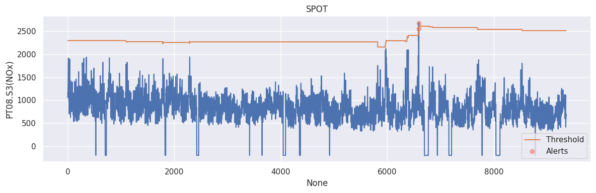
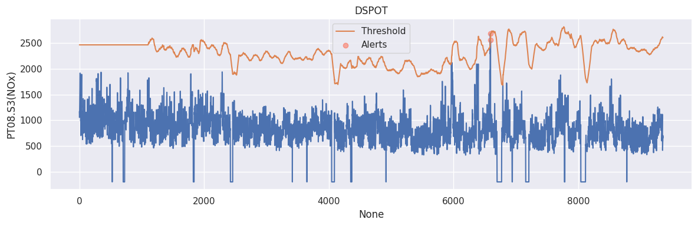

# peaks-over-threshold

> [!WARNING]
> This is a quick implementation over the weekend,
> expect bugs, unpolished and untested code.

Implementation of the peaks-over-threshold (POT) algorithm to detect extreme values in time series data,
including Streaming POT (SPOT) and Streaming POT with drift (DSPOT).

The implementation follows the paper: _Siffer, Alban, et al.
"Anomaly detection in streams with extreme value theory."
Proceedings of the 23rd ACM SIGKDD International Conference on Knowledge Discovery and Data Mining.
2017._

__Example Results__

_Please check the `examples` folder for more results._

